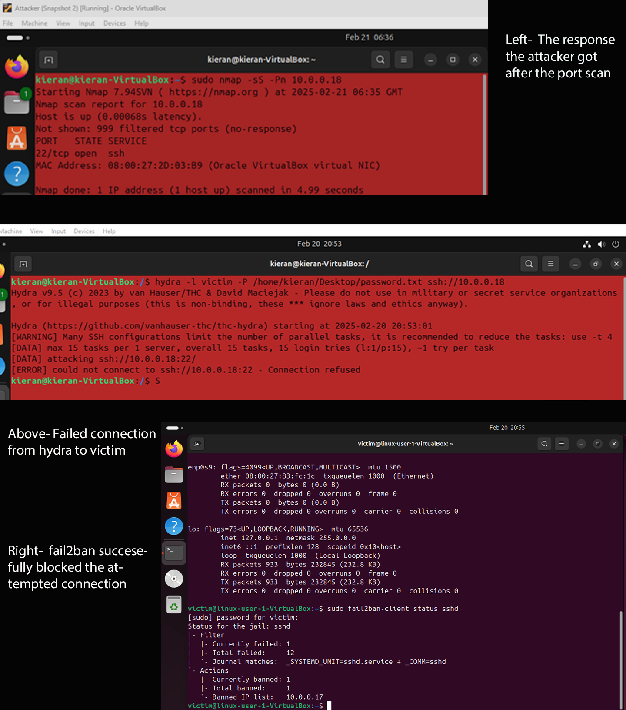

**Brute Force Attack**

In this scenario, an attacker conducted a port scan and identified that port 22 was open due to a misconfigured firewall. Using Hydra, they attempted to crack user passwords within the network, but these attempts were unsuccessful. To strengthen defenses, I configured Fail2ban, an Intrusion Prevention System (IPS), to block all unknown IPs making SSH attempts. Additionally, Fail2ban was set up to send email notifications to relevant parties for real-time alerts. By blacklisting IP addresses that made multiple failed SSH login attempts, Fail2ban effectively mitigated further brute-force attacks.

